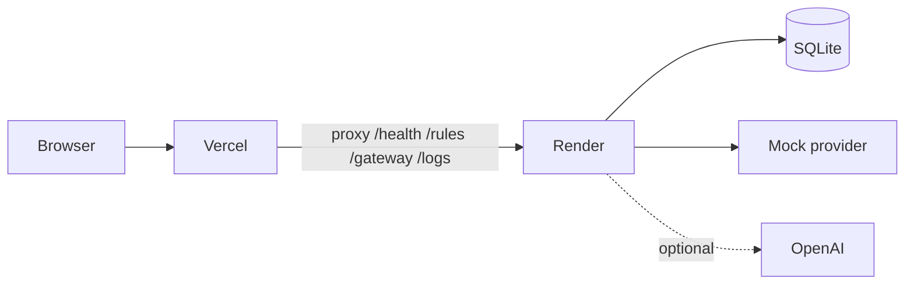

# Guardrail Gateway

[](https://github.com/Srikanthkn0/guardrail-gateway/actions/workflows/ci.yml)
[](LICENSE)

LLM safety gateway that inspects prompts and model responses before they reach a client app. Scan input, call a provider, scan output, redact blocked replies, and log every request.

| | Link |
|---|------|
| **Live app** | https://guardrail-gateway.vercel.app |
| **API** | https://guardrail-gateway-api.onrender.com |
| **API docs** | https://guardrail-gateway-api.onrender.com/docs |

Update live URLs in this README if you choose different Vercel/Render service names.

## Features

- 22 guardrail rules (15 input, 7 output) with allow / warn / block decisions
- Provider routing: mock (default, no keys), OpenAI, Groq
- Output redaction when output rules block a model reply
- SQLite request logging with `/logs`, `/stats`, and dashboard filters
- 61 pytest cases including adversarial regression strings
- GitHub Actions CI (backend tests + frontend build)

## How it works



1. Client sends a prompt to `POST /gateway/chat`.
2. Input scanner runs phrase/regex rules. Block stops the request.
3. Allow/warn forwards to the configured provider (mock by default on Render).
4. Output scanner checks the model reply. Block redacts `response_text`.
5. Request metadata and rule hits are stored in SQLite.

## Stack

| Layer | Technology |
|-------|------------|
| Backend | FastAPI, gunicorn, SQLite |
| Frontend | React, Vite |
| Providers | Mock, OpenAI, Groq (optional) |
| CI | GitHub Actions |
| Deploy | Vercel (frontend) + Render (API) |

## Repository layout

```
guardrail-gateway/
  backend/           FastAPI API, rules engine, pytest suite
  frontend/          React dashboard (Overview, Rules, Chat, Logs)
  render.yaml        Render blueprint
  .github/workflows/ CI pipeline
```

## Local development

**Backend**

```bash
cd backend
python3 -m venv venv
./venv/bin/pip install -r requirements.txt
cp .env.example .env
./run.sh
```

If port 8000 is busy:

```bash
PORT=8010 ./run.sh
```

Set `VITE_API_BASE_URL=http://localhost:8010` in `frontend/.env`.

**Frontend**

```bash
cd frontend
npm install
cp .env.example .env
npm run dev
```

Open http://localhost:5173.

## Frontend panels

| Tab | Purpose |
|-----|---------|
| Overview | Health, decision breakdown, provider stats, recent requests |
| Rules | Test input/output scans; filterable rule catalog |
| Chat | Send prompts through the gateway; jump to log detail |
| Logs | Stats, decision/provider filters, pagination, rule hits |

## API

| Method | Path | Description |
|--------|------|-------------|
| GET | `/health` | Gateway status and provider availability |
| GET | `/rules` | List guardrail rules |
| POST | `/rules/test` | Scan input (optional output text) |
| POST | `/gateway/chat` | Full gateway flow |
| GET | `/logs` | List persisted requests |
| GET | `/logs/{request_id}` | Single log with rule hits |
| GET | `/stats` | Aggregate counts and rates |
| GET | `/docs` | OpenAPI docs |

## Deploy

### 1. Render (backend)

1. Push the repo to GitHub.
2. In [Render](https://render.com), **New → Blueprint** and point at the repo (uses `render.yaml`).
3. Service name should stay `guardrail-gateway-api` so `frontend/vercel.json` rewrites match.
4. Optional: add `OPENAI_API_KEY` or `GROQ_API_KEY` in Render env vars.
5. Confirm `https://guardrail-gateway-api.onrender.com/health` returns `ok`.

If your Vercel URL differs from `guardrail-gateway.vercel.app`, update `FRONTEND_ORIGINS` in `render.yaml` before deploying.

**Note:** Free-tier SQLite lives under `/tmp/guardrail-data` and resets on redeploy. Fine for demos; use a Render disk or external DB for durable logs.

### 2. Vercel (frontend)

1. Import the repo in [Vercel](https://vercel.com).
2. Set **Root Directory** to `frontend`.
3. Leave `VITE_API_BASE_URL` unset (same-origin proxy handles API calls).
4. Deploy. `vercel.json` proxies API paths to Render.

If your Render URL differs, update the `destination` URLs in `frontend/vercel.json`.

### 3. Verify production

```bash
curl -s https://guardrail-gateway.vercel.app/health
curl -s -X POST https://guardrail-gateway.vercel.app/gateway/chat \
  -H "Content-Type: application/json" \
  -d '{"prompt":"What is the capital of France?"}'
```

## Tests

```bash
cd backend
./venv/bin/pip install -r requirements-dev.txt
./venv/bin/pytest tests/ -v
```

Adversarial cases: `backend/tests/test_adversarial.py`, `backend/tests/fixtures/adversarial_cases.py`.

## Resume bullets

- Built a full-stack LLM safety gateway (FastAPI + React) that scans prompts and model outputs, routes to multiple providers, and redacts blocked responses before they reach clients.
- Designed a phrase/regex rule engine with combined allow/warn/block decisions, 61 automated tests, and an adversarial regression suite covering injection and credential-leak patterns.
- Deployed the dashboard on Vercel with same-origin API proxying to a Render-hosted FastAPI backend; added GitHub Actions CI for backend tests and frontend builds.

## License

MIT. See [LICENSE](LICENSE).